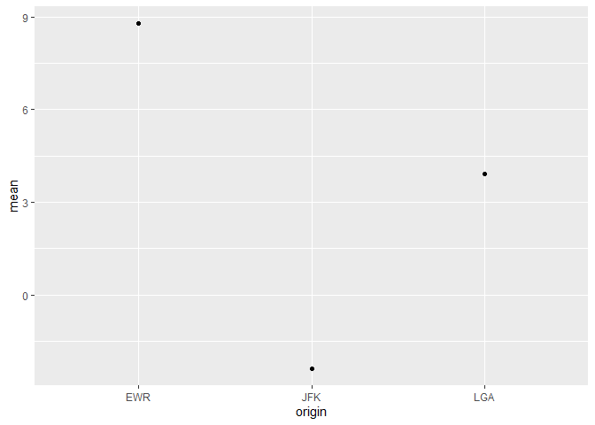

## Introduction

I kept my graph making pretty simple, using means and getting rid of airports with a minimal amount of data.


## Question 2

For question 2, I took the flights dataset and filtered it down to just Delta flights and then grouped it by the origin airport. I looked at the three airports that flew Delta Airlines and found that JFK has lowest mean for arr_delay so it is the best option to minimize chances of a late arrival.


```r
library(tidyverse)
library(nycflights13)
library(ggbeeswarm)


Delta <- filter(flights, carrier == "DL")

DeltaGB <- group_by(Delta, origin)

DeltaGB <- summarise(DeltaGB,
                      mean = mean(arr_delay, na.rm = TRUE),
                      sd = sd(arr_delay, na.rm = TRUE))


ggplot(data = DeltaGB)+
  geom_point(mapping = aes(x = origin, y = mean))
```

<!-- -->

## Question 3

For the third question I grouped by the destination and looked at the mean for arrival delay. I filtered out airports with less than 40 pieces of data because I felt like that's not enough data to be used. I found that the CAE airport had the worst average arrival delay around 42 minutes on average. 


```r
flightsworst <- group_by(flights, dest)

flightsworst <- summarise(flightsworst,
                            mean = mean(arr_delay, na.rm = TRUE),
                            sd = sd(arr_delay, na.rm = TRUE),
                            count = n())

flights2 <- filter(flightsworst, 
                    count >40)

library(ggrepel)

ggplot(data = flights2)+
    geom_point(mapping = aes(x = reorder(dest, mean), y = mean))+
    geom_text_repel(aes(x = dest, y = mean, label = dest))+
    theme(axis.text.x = element_blank(),
          axis.ticks.x = element_blank())
```

<!-- -->
