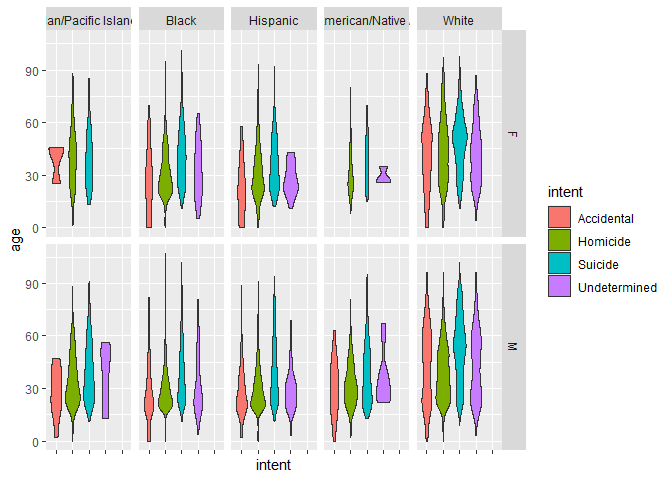
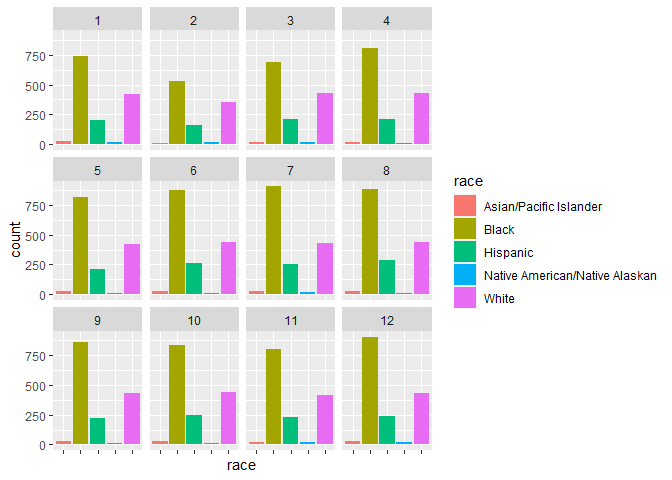
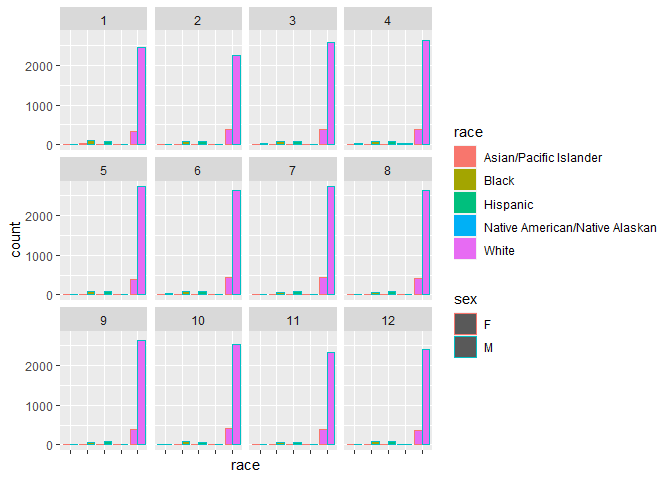
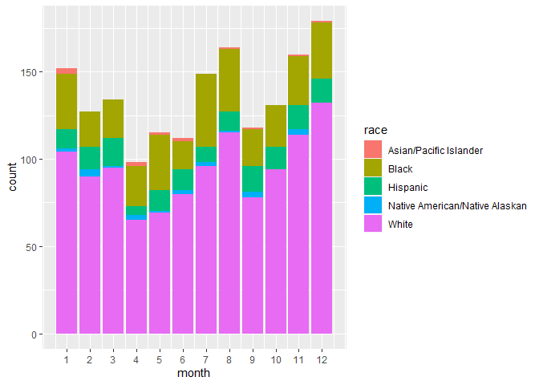

```r
library(tidyverse)

data <- read.csv("https://raw.githubusercontent.com/fivethirtyeight/guns-data/master/full_data.csv")

ggplot(data, aes(x = intent,  y = age, fill = intent))+
  geom_violin()+
  facet_grid(vars(sex), vars(race))+
  theme(
      axis.text.x = element_blank()
  )
```

<!-- -->

## Article Summarization

Usually people focus on mass shootings, police victims, and terrorism, but most gun deaths are suicide. 85% of suicides are males. More than half are men older than 45. Another third are homicides (12,000). More than half of homicides are young men. Two-thirds of these young men are black. about 1,700 women die due to domestic violence. The remaining deaths are accidents.

## Areas of Emphasis


```r
homicide <- filter( data, intent == "Homicide", age > 25, sex == 'M')

ggplot(homicide)+
  geom_bar(mapping = aes(x= race, fill = race))+
  theme(axis.text.x = element_blank())+
  facet_wrap(~month)
```

<!-- -->

I created a graph that only included homicides under 25 and male years old since that was a big proportion of their data. I found that generally speaking, black males accounted for the most deaths around July, August, and December, so a lot in summer and a little in winter


```r
oldsuicide <- filter (data, age > 45, intent == "Suicide")

ggplot(oldsuicide)+
  geom_bar(mapping = aes(x= race, fill = race, color = sex), position = 'dodge')+
  theme(axis.text.x = element_blank())+
  facet_wrap(~month)
```

<!-- -->

My second graph took a data set that was filtered out to people over 45 and death due to suicide. I found that white men account for the most and we need to target them during the WHOLE year, but especially during the winter months, from about October to January, so about late fall to mid-winter


```r
accident <- filter(data, intent == "Accidental")

ggplot(accident)+
  geom_bar(mapping = aes(x = month, fill = race))+
  scale_x_continuous(breaks = 1:12)
```

<!-- -->

My last graph I created, I took a look at the accidents. This has to do with general gun safety and is most likely the easiest to do away with. I think we need to empasize gun safety during August, November, and December, so early fall to winter. 
