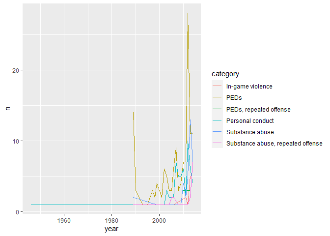

## Summary
I was able to find some interesting datasets that I could definitely explore a lot of different avenues with and could create a lot of interesting, valuable visualizations with. I'm still struggling a little bit with downloading the datasets from the websites through r. I have found that it is just a little more convenient for me at least, to just download the datasets to my directory and load them in that way.

## Sources

My first dataset came from the repository, https://github.com/fivethirtyeight/data/tree/master/nfl-suspensions, and it explored all the NFL suspensions from 1990 to 2014. This is a good data set that while complex and full of data, it is actually quite simple to understand. 

My second dataset came from the link, https://data.world/dataquest/mlb-game-logs, and is quite possibly the most complex dataset I have ever seen. It has the game log for every MLB game going back to 1871 and has every single stat for each game. There are 161 variables, so I could definitely create many, many interesting, storytelling visuals. 

My third dataset came from the link, https://data.world/gmoney/nba-players-birthplaces, and is also one of the most complex datasets I have looked at. As the one before, I could use this in answering many question that aren't easily answered


```r
library(tidyverse)

susdata <- read_csv("nfl-suspensions-data.csv")


susdata1 <- group_by(susdata, year, category) %>%
                count(category, year, sort = TRUE)
                     

ggplot(data = susdata1)+
  geom_line(mapping = aes(x = year, y = n, color = category))
```

<!-- -->

```r
gldata <- read_csv("game_logs.csv")


gldata1 <- group_by(gldata, winning_pitcher_name) %>%
  count(winning_pitcher_name, sort = TRUE) %>%
  filter(n < 30000, n > 230)


ggplot(data = gldata1) +
    geom_col(mapping = aes(x = winning_pitcher_name, y = n, fill = winning_pitcher_name))
```

<!-- -->

## Limitations

Unfortunately, I wasn't able to find good datasets with the data I needed to know for my questions so I opened it up and looked for new questions. 

