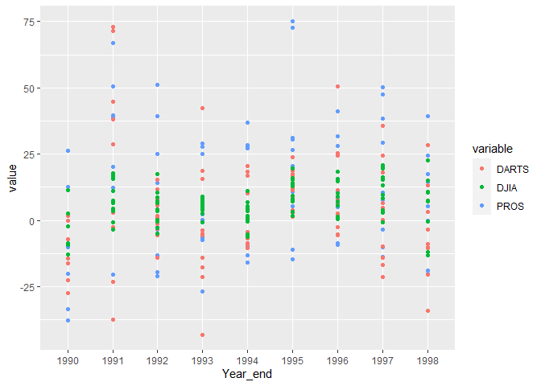
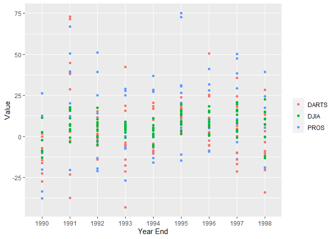

```r
library(tidyverse)
library(haven)
library(readr)
library(readxl)
library(downloader)

dfdta  <- read_dta("https://github.com/WJC-Data-Science/DTS350/raw/master/Dart_Expert_Dow_6month_anova/Dart_Expert_Dow_6month_anova.dta")

dfdta1 <- dfdta %>%
  separate(contest_period, into = c("Month/Month","Year_end"), sep = -4)

dfdta2 <- dfdta %>%
  separate(contest_period, into = c("Month/Month","Year_end"), sep = -4) %>%
  group_by(Year_end, variable) %>%
  summarise( mean = mean(value))

## Tidy the data

dfdta3 <- dfdta1 %>%
  separate(`Month/Month`, into = c("month_begin","month_end"), sep = "-")

view(dfdta3)


## Final Table

dfdta4 <- dfdta3 %>%
  mutate(month_end = replace(month_end, month_end == "Dec.", "December")) %>%
  mutate(month_end = replace(month_end, month_end == "Febuary", "February")) %>%
  select(-c(month_begin)) %>%
  filter(variable == "DJIA") %>%
  pivot_wider(names_from = Year_end, values_from = value) %>%
  select(-c(variable)) %>%
  mutate(month_end = replace(month_end, month_end == "January", 1)) %>%
  mutate(month_end = replace(month_end, month_end == "February", 2)) %>%
  mutate(month_end = replace(month_end, month_end == "March", 3)) %>%
  mutate(month_end = replace(month_end, month_end == "April", 4)) %>%
  mutate(month_end = replace(month_end, month_end == "May", 5)) %>%
  mutate(month_end = replace(month_end, month_end == "June", 6)) %>%
  mutate(month_end = replace(month_end, month_end == "July", 7)) %>%
  mutate(month_end = replace(month_end, month_end == "August", 8)) %>%
  mutate(month_end = replace(month_end, month_end == "September", 9)) %>%
  mutate(month_end = replace(month_end, month_end == "October", 10)) %>%
  mutate(month_end = replace(month_end, month_end == "November", 11)) %>%
  mutate(month_end = replace(month_end, month_end == "December", 12)) 

dfdta4$month_end <- as.integer(dfdta4$month_end)

dfdta4 <- dfdta4[order(dfdta4$month_end),]

dfdta4 <- dfdta4 %>%
  mutate(month_end = replace(month_end, month_end == 1,"January")) %>%
  mutate(month_end = replace(month_end, month_end == 2,"February")) %>%
  mutate(month_end = replace(month_end, month_end == 3,"March")) %>%
  mutate(month_end = replace(month_end, month_end == 4,"April")) %>%
  mutate(month_end = replace(month_end, month_end == 5,"May")) %>%
  mutate(month_end = replace(month_end, month_end == 6,"June")) %>%
  mutate(month_end = replace(month_end, month_end == 7,"July")) %>%
  mutate(month_end = replace(month_end, month_end == 8,"August")) %>%
  mutate(month_end = replace(month_end, month_end == 9,"September")) %>%
  mutate(month_end = replace(month_end, month_end == 10,"October")) %>%
  mutate(month_end = replace(month_end, month_end == 11,"November")) %>%
  mutate(month_end = replace(month_end, month_end == 12,"December"))


view(dfdta4)


## 6-month returns

ggplot(data = dfdta3)+
  geom_point(mapping = aes(x = Year_end, y = value, color = variable))
```

<!-- -->

This is the graph without "scale_x_discrete(drop = FALSE)"


```r
## 6-month returns

ggplot(data = dfdta3)+
  geom_point(mapping = aes(x = Year_end, y = value, color = variable))+
  labs(x = "Year End",
       y = "Value",
       color = "")
```

<!-- -->

```r
  scale_x_discrete(drop = FALSE)
```

```
## <ggproto object: Class ScaleDiscretePosition, ScaleDiscrete, Scale, gg>
##     aesthetics: x xmin xmax xend
##     axis_order: function
##     break_info: function
##     break_positions: function
##     breaks: waiver
##     call: call
##     clone: function
##     dimension: function
##     drop: FALSE
##     expand: waiver
##     get_breaks: function
##     get_breaks_minor: function
##     get_labels: function
##     get_limits: function
##     guide: waiver
##     is_discrete: function
##     is_empty: function
##     labels: waiver
##     limits: NULL
##     make_sec_title: function
##     make_title: function
##     map: function
##     map_df: function
##     n.breaks.cache: NULL
##     na.translate: TRUE
##     na.value: NA
##     name: waiver
##     palette: function
##     palette.cache: NULL
##     position: bottom
##     range: <ggproto object: Class RangeDiscrete, Range, gg>
##         range: NULL
##         reset: function
##         train: function
##         super:  <ggproto object: Class RangeDiscrete, Range, gg>
##     range_c: <ggproto object: Class RangeContinuous, Range, gg>
##         range: NULL
##         reset: function
##         train: function
##         super:  <ggproto object: Class RangeContinuous, Range, gg>
##     rescale: function
##     reset: function
##     scale_name: position_d
##     train: function
##     train_df: function
##     transform: function
##     transform_df: function
##     super:  <ggproto object: Class ScaleDiscretePosition, ScaleDiscrete, Scale, gg>
```

This the the graph with " scale_x_discrete(drop = FALSE)"

In order this line to change the graph, there would need to be different levels for the x values.
